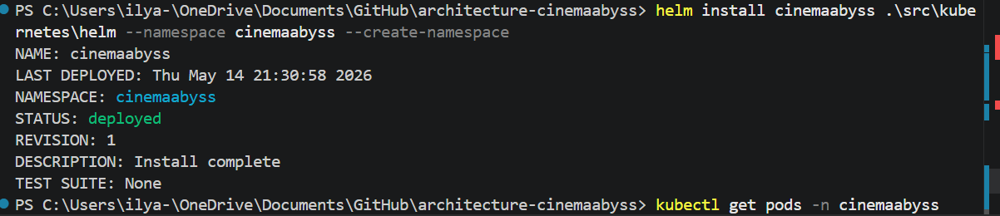
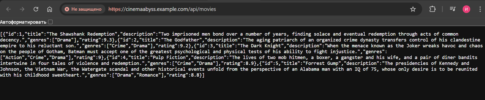

## Изучите [README.md](.\README.md) файл и структуру проекта.

# Задание 1

[Диграмма контейнеров to_be](https://github.com/ISamburskiy/architecture-cinemaabyss/blob/cinema/diagrams/to_be_container.png)

# Задание 2

Тесты:

Состояние топиков:

# Задание 3

Запрос фильмов:

Результаты тестов:

Логи events-service:

# Задание 4
Запуск helm

Проверка апи movies после запуска helm

